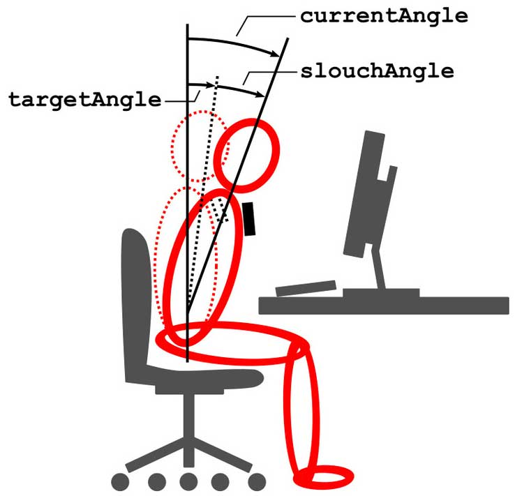
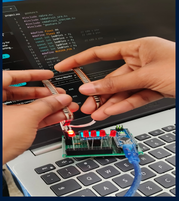
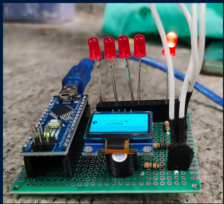
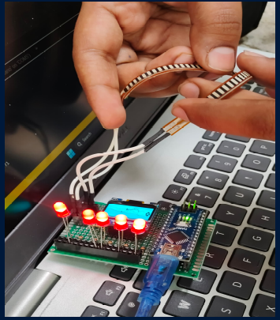

<h1 align="center">
BODY SLOUCH DETECTOR        
</h1>

***

This project proposes the development of a wearable body slouch detector. This device would continuously monitor posture, providing real-time feedback to users when their alignment deviates from a healthy position. Ultimately, this project aims to promote better posture awareness and encourage positive behavior change, leading to improved health and well-being for individuals.

<h2 align="left">
skills required
</h2>

    

## Components used
1. **Arduino** 
2. **Flex sensor**
3. **Oled I2C module (0.96 inch)**
4. **Buzzer**
5. **LED x5**

## Port Connections
| Arduino     | Components     |
| ------------- | ------------- |
| d2 | Led 1 |
| d3 | Led 2 |
| d4 | Led 3 |
| d5 | Led 4 |
| d6 | Led 5 |
| d7 | Buzzer |
| A5 | SCL |
| A4 | SCA |

<h2 align='center'> Images </h2> 

<h2 align = 'left'>
 	authors
</h2>

 <a href="https://github.com/m-medha" > medha 

 <a href="https://github.com/pavnkumr0/" > Pavan Kumar G 

